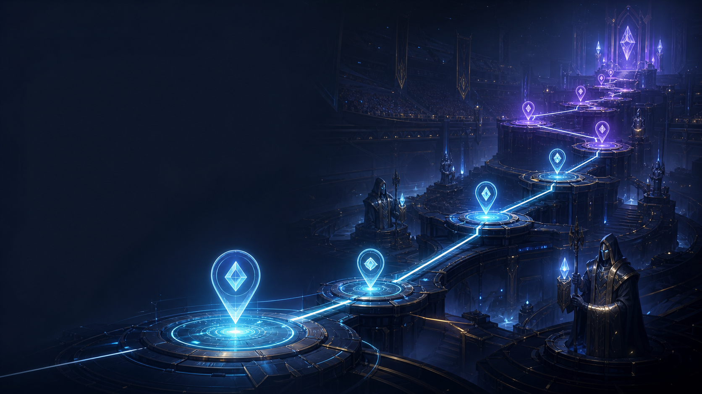

# BattleLuck



BattleLuck is a server-side BepInEx IL2CPP plugin for V Rising dedicated servers. It provides configurable competitive and cooperative game events, managed player sessions, rollback-safe player state and loadouts, NPC and boss control, progression and death-prevention systems, teleports, zones, schematics, and an ECS-backed action pipeline.

Event behavior is defined through configuration and validated before execution. Optional local AI tools can assist with verified action discovery, event authoring, runtime announcements, and approval-gated configuration changes. Network-based AI work runs asynchronously, while ProjectM and Unity ECS mutations are dispatched to the server main thread.

## Install

1. Install BepInEx for V Rising on the dedicated server.
2. Install the package with a Thunderstore-compatible mod manager, or copy the package files into the server's `BepInEx` folder.
3. Start the server once, then edit files under `BepInEx/config/BattleLuck/`, including event definitions inside `BepInEx/config/BattleLuck/events/<eventId>/`.
4. Use `.help` in game to see the commands available to your permission level.

AI is optional and local-first. It is disabled until a server owner configures a provider and explicitly enables the requested features.

## Included features

- Match-ready, action-driven event flow for arena and custom V Rising events.
- NPC control, boss commands, generic actions, and safe action reachability checks.
- Player event sessions, loadouts, progression, death-prevention charges, native-backed rollback snapshots, and restore-on-exit flows.
- Teleport services, spatial points, borders, schematics, and verified data catalogs.
- Optional local LLM prompts for event and mod authoring with approval gates and main-thread-safe execution.

## Common commands

All commands use the `.` prefix. This is a common-command overview, not the complete command surface. Use `.help` in game for the live permission-aware list.

### Player commands

```text
.help                          Show available BattleLuck commands
.toggleenter [modeName]        Join an event zone
.toggleleave                   Leave an event cleanly and restore your state
.exit                          Force-exit the current event
.score                         Show the current scoreboard
.elo                           Show Colosseum rating
.ai <message>                  Ask the optional AI assistant
.aistatus                      Show local AI status
```

### Admin commands

```text
.reload                        Reload BattleLuck configuration
.start                         Force-start your prepared event session
.rollback <operationId>        Roll back a pending AI event operation
.swapteam [closest|balance]    Balance or move event teams
.swapteam.ai [options]         Balance teams and announce with AI
.event.create <eventId>        Clone Bloodbath into a custom event
.event.start <mode>            Start and enter an event mode
.event.end <mode>              End a mode's active sessions
.event.status                  Show active events and player counts
.modelist                      List registered modes
.bstatus                       Show live BattleLuck runtime status
.npc.near [radius] [limit]      List nearby controlled NPCs
.npc.spawn <prefab> [count]     Spawn controlled NPCs
.npc.follow <npcId> [target]    Make an NPC follow a target
.npc.goto <npcId> [x y z]       Move an NPC
.npc.despawn <npcId|all>        Despawn controlled NPCs
.boss.spawn <prefab> [id]       Spawn a controlled boss/NPC
.boss.list                      List controlled bosses/NPCs
.ai.reload                      Reload AI configuration
.ai.status                      Show detailed AI provider status
.ai catalog search <text>       Search verified actions and data
.ai event request <change>      Draft an event or mod edit for review
.ai event preview <id>          Preview a proposed edit
.ai event approve <id>          Apply an approved edit
.roadmap.status                 Show roadmap milestones
.roadmap.prompt <llm|developer> Show the active prompt contract
.schematic.list                 List loaded arena schematics
.schematic.capture <name>       Capture a nearby schematic
```

Live AI changes remain preview-first and approval-gated. Use `.ai event rollback <operationId>` when a supported operation needs to be reverted.

### Create your own Bloodbath-style event

Admins can create a complete editable event without adding C# code:

```text
.event.create shadow_hunt bloodbath
```

This creates `config/BattleLuck/events/shadow_hunt/` with its own `flow.json`, `zones.json`, `kits.json`, and `prompt.txt`, assigns a unique zone hash, and registers the event immediately. Customize the copied zone center, kit, actions, phases, timers, and prompt, then run `.event.start shadow_hunt`.

## Support

Maintainer: **coyoteq1 — Ahmadtllal**  
Discord support: <https://discord.gg/uJ2ehWv4gR>

## Documentation

- [User guide](docs/user/README.md)
- [Developer guide](docs/developer/README.md)
- [AI and prompt guide](docs/LLM_GUIDE.md)
- [Publishing checklist](docs/PUBLISHING_CHECKLIST.md)
- [V Rising Mod Wiki](https://wiki.vrisingmods.com/)
- [V Rising Mod Wiki: Thunderstore upload](https://wiki.vrisingmods.com/dev/upload_to_thunderstore.html)
- [V Rising Mod Wiki: licensing](https://wiki.vrisingmods.com/dev/licensing.html)

## License

BattleLuck is licensed under the GNU Affero General Public License, version 3 or any later version. See [LICENSE](LICENSE) and [THIRD_PARTY_NOTICES.md](THIRD_PARTY_NOTICES.md).
